**Ketcher** is a tool to draw molecular structures and chemical reactions.

# Ketcher Overview

**Ketcher** is a tool to draw molecular structures and chemical reactions. Ketcher operates in two modes, the Server mode with most functions available and the client mode with limited functions available.

**Ketcher** consists of the following elements:

 

**Note** : Depending on the screen size, some tools on the _Tool palette_ can be displayed in expanded or collapsed forms.

Using the _Tool palette,_ you can

- draw and edit a molecule or reaction by clicking on and dragging atoms, bonds, and other elements provided with the buttons on the _Atoms_ toolbar and _Tool palette_;
- delete any element of the drawing (atom or bond) by clicking on it with the Erase tool;
- delete the entire molecule or its fragment by a lasso, rectangular, or fragment selection with the Erase tool;
- draw special structures (see the following sections);
- select the entire molecule or its fragment in one of the following ways (click on the button to see the list of available options):

a)  in the expanded form

 

b)  in the collapsed form

 

To select one atom or bond, click Lasso or Rectangle Selection tool, and then click the atom or bond.

To select the entire structure:

- Select the Fragment Selection tool and then click the object.
- Select the Lasso or Rectangle Selection tool, and then drag the mouse to select the object.
- Ctrl-click with the Lasso or Rectangle Selection tool.

To select multiple atoms, bonds, structures, or other objects, do one of the following:

- Shift-click with the Lasso or Rectangle Selection tool selects some (connected or not) atoms/bonds.
- With the Lasso or Rectangle Selection tool click and drag the mouse around the atoms, bonds, or structures that you want to select.

**Note** : Ctrl+Shift-click with the Lasso or Rectangle Selection tool selects several structures.

You can use the buttons of the _Main_ toolbar:

 

- **Clear Canvas** (1) button to start drawing a new molecule; this command clears the drawing area;
- **Open…** (2) and **Save As…** (3) buttons to import a molecule from a molecular file or save it to a supported molecular file format;
- **Undo** / **Redo** (4), **Cut** (5), **Copy** (6), **Paste** (7), **Zoom In** / **Out** (8), and **Scaling** (9) buttons to perform the corresponding actions;
- **Layout** button (10) to change the position of the structure to work with it with the most convenience;

- **Clean Up** button (11) to improve the appearance of the structure by assigning them uniform bond lengths and angles.
- **Aromatize** / **Dearomatize** buttons (12) to mark aromatic structures (to convert a structure to the Aromatic or Kekule presentation);
- **Calculate CIP** button (13) to determine R/S and E/Z configurations;
- **Check structure** button (14) to check the following properties of the structure:

 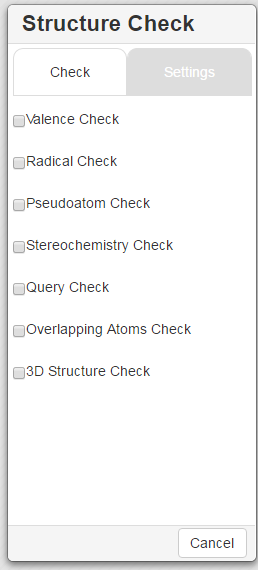

- **Calculated Values** button (15) to display some properties of the structure:

 

- **Recognize molecule** button (16) to recognize a structure in the image file and load it to the canvas;
- **3D Viewer** button (17) to open the structure in the three-dimensional Viewer;
- **About** button (18) to display version and copyright information of the program;
- **Settings** button (19) to make some settings for molecular files.

**Note** : **Clean, Aromatize** / **Dearomatize,**  **Calculate CIP,** and **3D View** buttons are active only in the Server mode.

# 3D Viewer

The structure appears in a modal window after clicking on the **3D Viewer** button:

 

You can perform the following actions:

- Rotate the structure holding the left mouse button;
- Move the structure tapping on keyboard arrows;
- Zoom In/Out the structure;

Menu in top left corner of the window allows to:

- Change the appearance of the structure and background coloring;
- Load a new structure;
- Save the position of the structure.

 

&quot;Lines&quot; drawing method, &quot;Atom name&quot; coloring method, &quot;Low&quot; resolution, &quot;Colored&quot; atom names and &quot;White&quot; background coloring are default.

&quot;Colored&quot; atom names changes to &quot;No&quot;, which becomes default when the number of atoms is more than 100.

# Drawing Atoms

To draw/edit atoms you can:

- select an atom in the Atoms toolbar and click inside the drawing area;
-
??if the desired atom is absent in the toolbar, click on the  button to invoke the Periodic Table and click on the desired atom (available options: _Single_ – selection of a single atom, _List_ – choose an atom from the list of selected options (To allow one atom from a list of atoms of your choice at that position), _Not List_ - exclude any atom on your list at that position).

 

- add an atom to the existing molecule by selecting an atom in the _Atoms_ toolbar, clicking on an atom in the molecule, and dragging the cursor; the atom will be added with a single bond; vacant valences will be filled with the corresponding number of hydrogen atoms;
- change an atom by selecting an atom in the _Atoms_ toolbar and clicking on the atom to be changed; in the case a wrong valence thus appears the atom will be underlined in red;
- change an atom by clicking on an existing atom with the _Selection_ tool and waiting for a couple of seconds for the text box to appear; type another atom symbol in the text box:

 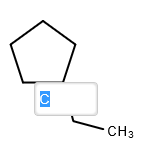

- change the charge of an atom by selecting the Charge Plus or Charge Minus tool and clicking consecutively on an atom to increase/decrease its charge

 

- change an atom or its properties by double-clicking on the atom to invoke the Atom Properties dialog (the dialog also provides atom query features):

 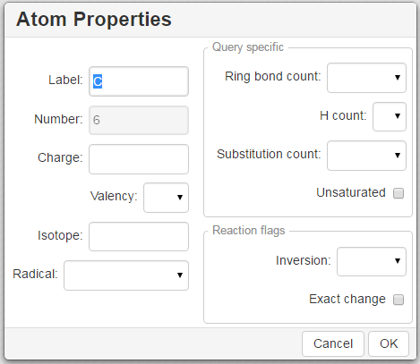

- click on Generic Groups to invoke the Generic Groups dialog and select a corresponding Reaxys generic group:

 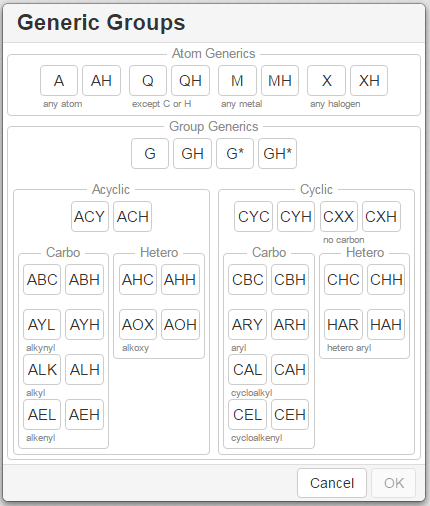

# Drawing Bonds

To draw/edit bonds you can:

-
??Click an arrow on the Bond tool    in the Tools palette to open the drop-down list with the following bond types:

 

\*For the full screen format, the Bond tool from the Tools palette splits into three: _Single Bond,__Single Up Bond,_ and _Any Bond_,which include the corresponding bond types:

 

- select a bond type from the drop down list and click inside the drawing area; a bond of the selected type will be drawn;
- click on an atom in the molecule; a bond of the selected type will be added to the atom at the angle of 120 degrees;
- add a bond to the existing molecule by clicking on an atom in the molecule and dragging the cursor; in this case you can set the angle manually;
- change the bond type by clicking on it;
-
??use the Chain Tool   to draw consecutive single bonds; you can use hotkeys to change atom types.
- change a bond or its properties by double-clicking on the bond to invoke the Bond Properties dialog:

 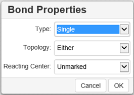

- clicking on a drawn stereo bond changes its direction.
- clicking with the Single Bond tool switches the bond type cyclically: Single-Double-Triple-Single.

# Drawing R-Groups

Use the _R-Group_ toolbox  to draw R-groups in Markush structures:

 

\*For the full screen format, the _R-Group_ splits into separate buttons:

 

Selecting the _R-Group_ _Label_ Tool and clicking on an atom in the structure invokes the dialog to select the R-Group label for a current atom position in the structure:

 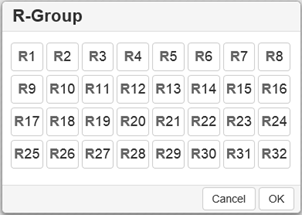

Selecting the R-Group label and clicking **OK** converts the structure into a Markush structure with the selected R-Group label:

 

**Note** : You can choose several R-Group labels simultaneously:

 

Particular chemical fragments that may be substituted for a given R-Group form a set of R-Group members. R-Group members can be any structural fragment, including functional groups and single atoms or atom lists.

To create a set of R-Group members:

1.   Draw a structure to become an R-Group member.

2.   Select the structure using the _R-Group Fragment Tool_ to invoke the R-Group dialog; in this dialog select the label of the R-Group to assign the fragment to.

3.   Click on **OK** to convert the structure into an R-Group member.

An R-Group attachment point is the atom in an R-Group member fragment that attaches the fragment to the initial Markush structure.

Selecting the _Attachment Point Tool_ and clicking on an atom in the R-Group fragment converts this atom into an attachment point. If the R-Group contains more than one attachment point, you can specify one of them as primary and the other as secondary. You can select between either the primary or secondary attachment point using the dialog that appears after clicking on the atom:

 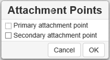

If there are two attachment points on an R-Group member, there must be two corresponding attachments (bonds) to the R-Group atom that has the same R-Group label. Clicking on **OK** in the above dialog creates the attachment point.

Schematically, the entire process of the R-Group member creation can be presented as:

 

 

# R-Group Logic

**Ketcher** enables one to add logic when using R-Groups. To access the R-Group logic:

1.   Create an R-Group member fragment as described above.

2.   Move the cursor over the entire fragment for the green frame to appear, then click inside the fragment. The following dialog appears:

 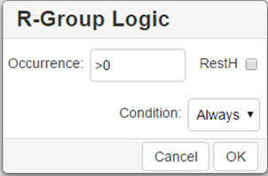

3.   Specify **Occurrence** to define how many of an R-Group occurs. If an R-Group atom appears several times in the initial structure, you will specify **Occurrence**&quot;&gt;n&quot;, n being the number of occurrences; if it appears once, you see &quot;R1 &gt;0&quot;.

4.   Specify H at **unoccupied** R-Group sites ( **RestH** ): check or clear the checkbox.

5.   Specify the logical **Condition**. Use the R-Group condition **If R(i) Then** to specify whether the presence of an R-Group is dependent on the presence of another R-Group.

#

# Marking S-Groups

To mark S-Groups, use the _S-Group tool_  and the following dialog that appears after selecting a fragment with this tool:

 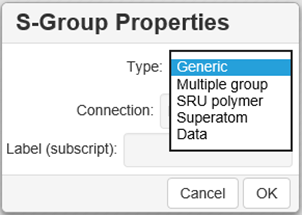

Available S-Group types:

_Generic_

Multiple group is a pair of brackets without any labels that represents a fixed number of identical repeating units in condensed form.

_SRU Polymer_

The Structural Repeating Unit (SRU) brackets enclose the structural repeating of a polymer. You have three available patterns: head-to-tail (the default), head-to-head, and either/unknown.

_Superatom_

An abbreviated structure (abbreviation) is all or part of a structure (molecule or reaction component) that has been abbreviated to a text label. Structures that you abbreviate keep their chemical significance, but their underlying structure is hidden. The current version can&#39;t display contracted structures but correctly saves/reads them into/from files.

_Data_

Attached data is numeric or text data that you can associate with all or part of a structure. You can attach data to an atom, a bond, a fragment, the entire structure or to any collection of atoms and bonds. For this type of S-Groups the S-Group Properties dialog changes into:

 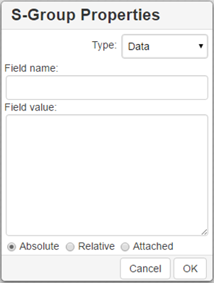

- Add the appropriate S-Group Field Name. If you enter a wrong value, the attached data can be saved to a molfile but cannot be registered to the target database or used in a search.
- Type the appropriate Field Value.
- Labels can be specified as Absolute, Relative or Attached.

# Data S-Groups

The _Data S-Groups Tool_  is a separate tool for comfortable use with the accustomed set of descriptors (like Attached Data in **Marvin** Editor).

You can attach data to an atom, a fragment, a single bond, or a group. The defined set of _Names_ and _Values_ is introduced for each type of selected elements:

 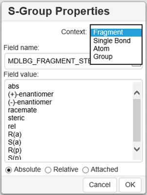

- Select the appropriate S-Group Field Name.
- Select or type the appropriate Field Value.
- Labels can be specified as Absolute, Relative or Attached.

# Changing Structure Display

Use the _Flip/Rotate_ tool  to change the structure display:

 

\*For the full screen format, the _Flip/Rotate_tool is split into separate buttons:

 

# Drawing Reactions

To draw/edit reactions you can

- draw reagents and products as described above;
-
??use options of the _Reaction Arrow Tool_  to draw an arrow and pluses in the reaction equation and map same atoms in reagents and products.

 

**Note** : Reaction Auto-Mapping Tool is available only in the Server mode.

# Templates toolbar

You can add templates (rings or other predefined structures) to the structure using the _Templates_ toolbar together with the _Custom Templates_ button located at the bottom:

 

To add a ring to the molecule, select a ring from the toolbar and click inside the drawing area, or click on an atom or a bond in the molecule.

Rules of using templates:

?         Selecting a template and clicking on an atom in the existing structure adds the template to the structure connected with a single bond:

 

- Selecting a template and dragging the cursor from an atom in the existing structure adds the template directly to this atom resulting in the fused structure:

 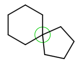

- Dragging the cursor from an atom in the existing structure results in the single bond attachment if the cursor is dragged to more than the bond length; otherwise the fused structure is drawn.
- Selecting a template and clicking on a bond in the existing structure created a bond-to-bond fused structure:

 

?         The bond in the initial structure is replaced with the bond in the template.

?         This procedure doesn&#39;t change the length of the bond in the initial structure.

?         Dragging the cursor relative to the initial bond applies the template at the corresponding side of the bond.

**Note** : The added template will be fused by the default attachment atom or bond preset in the program.

The _Custom Templates_ button invokes the scrolling list of templates available in the program; both built-in and created by user:

 

** **

#

# Working with Files

Ketcher supports the following molecular formats that can be entered either manually or from files:

?         MDL Molfile or RXN file;

?         Daylight SMILES (Server mode only);

?         InChi string (Server mode only);

?         CML file (Server mode only).

You can use the **Open…** and **Save As…** buttons of the _Main_ toolbar to import a molecule from a molecular file or save it to a supported molecular file format. The _Open Structure_ dialog enables one to either browse for a file (Server mode) or manually input, e.g., the Molfile ctable for the molecule to be imported:

 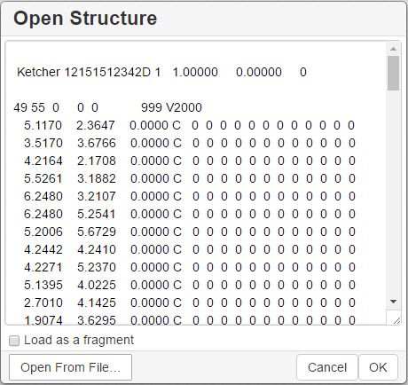

The _Save Structure_ dialog enables one to save the molecular file:

 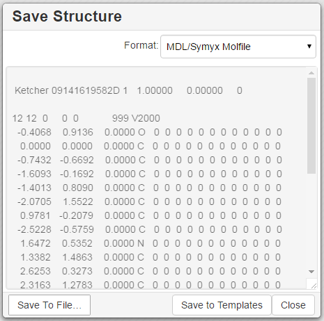

**Note** : In the standalone version only mol/rxn are supported for Open and mol/SMILES for Save.

#

# Hotkeys

You can use keyboard hotkeys (including Numeric keypad) for some features/commands of the Editor. To display the hotkeys just place the cursor over a toolbar button. If a hotkey is available for the button, it will appear in brackets after the description of the button.

| **Key** | **Action** |
| --- | --- |
| **Esc** | Switching between the Lasso/Rectangle/Fragment Selection tools |
| **0** | Draw Any bond. |
| **1** | Single / Single Up / Single Down / Single Up/Down bond. Consecutive pressing switches between these types. |
| **2** | Double / Double Cis/Trans bond |
| **3** | Draw a triple bond. |
| **4** | Draw an aromatic bond. |
| **R** | Creates an R-Group label. Use &lt;Shift&gt;+R to change the R-Group label type (R-Group Label Tool/R-Group Fragment Tool/Attachment Point Tool). |
| **A** | Draw any atom |
| **H** | Draw a hydrogen |
| **C** | Draw a carbon |
| **N** | Draw a nitrogen |
| **O** | Draw an oxygen |
| **S** | Draw a sulfur |
| **F** | Draw a fluorine |
| **P** | Draw a phosphorus |
| **Shift+C** | Draw a chlorine |
| **Shift+B** | Draw a bromine |
| **I** | Draw an iodine |
| **Shift+T** | Drawing templates. Consecutive pressing switches between different templates |
| **5** | Charge Plus/Charge Minus |
| **Ctrl+R** | Rotate tool |
| **Ctrl+G** | S-Group tool / Data S-Group tool |
| **Ctrl+N** | Clear canvas |
| **Ctrl+O** | Open |
| **Ctrl+S** | Save As |
| **Ctrl+Z** | Undo |
| **Ctrl+Y**** (Ctrl+Shift+Z)** | Redo |
| **Ctrl+X** | Cut selected objects |
| **Ctrl+C** | Copy selected objects |
| **Ctrl+V** | Paste selected objects |
| **+** | Zoom In |
| **-** | Zoom Out |
| **Delete** | Delete the selected objects |
| **Ctrl+L** | Clean Up |
| **Alt+P** | Calculate CIP |
| **Shift+/** | About |

**Note** : Please, use **Ctrl+V** to paste the selected object in Google Chrome and Mozilla Firefox browsers.
